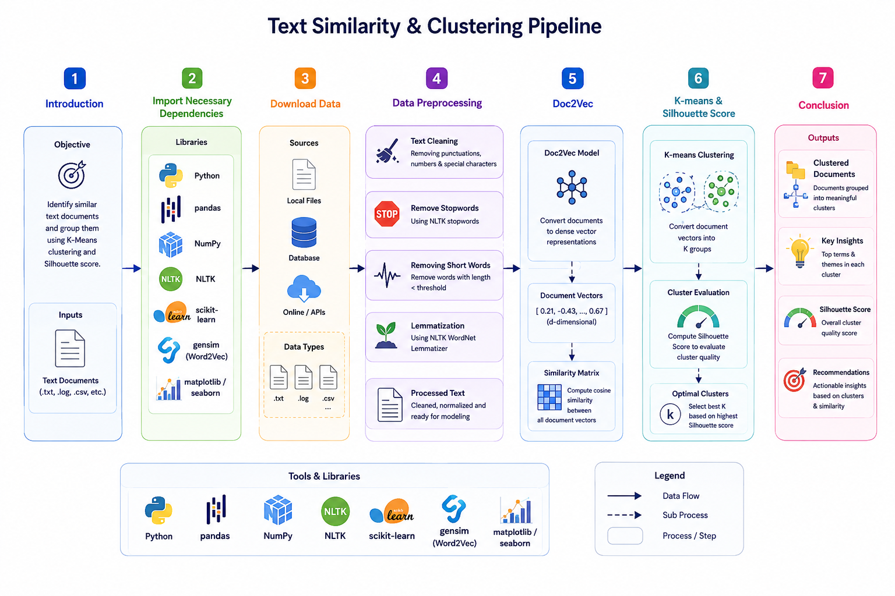
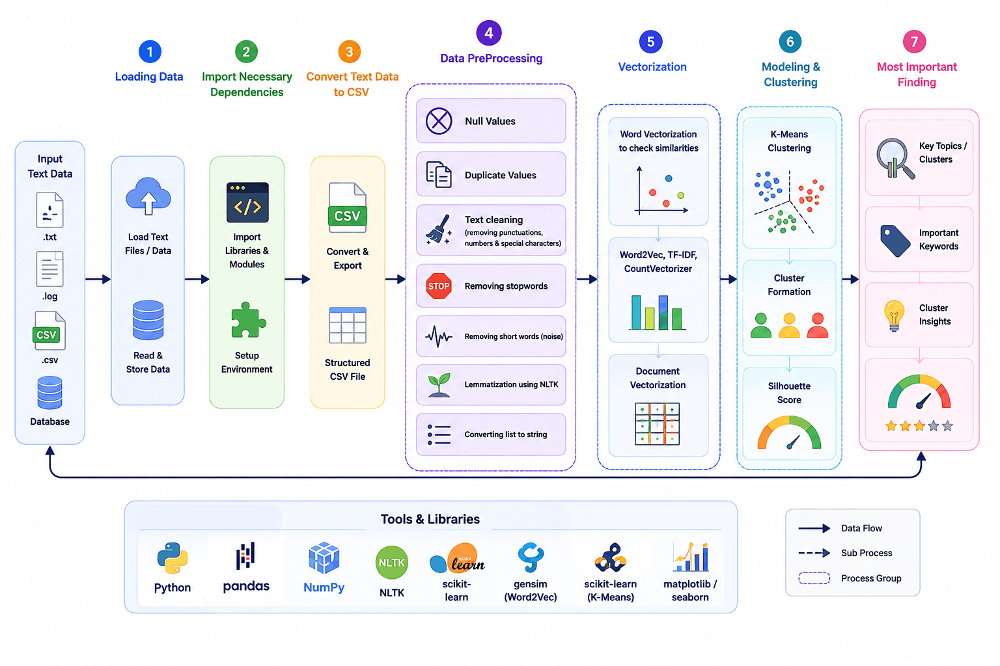

# Unsupervised Topic Discovery on BBC News Articles

K-Means clustering applied to BBC news text data to discover latent topics without using labels.

Two approaches for text vectorization:

- **Doc2Vec** (PV-DM) -- learns paragraph vectors directly from the corpus
- **Word2Vec + Average Pooling** -- averages word vectors per document to get a fixed-size representation

The notebook walks through the whole pipeline: loading data from Kaggle, cleaning and lemmatizing text, building vector representations, running K-Means for different values of K, and evaluating cluster quality with silhouette scores and cosine similarity inspection.

---

## Contents

### Doc2Vec Pipeline



<details>
<summary><b>k_means_news_topic_modeling_v2.ipynb</b></summary>

Uses Doc2Vec (PV-DM) for document vectorization. Covers:

- Loading the BBC full-text dataset via `kagglehub`
- Text cleaning, stopword removal, lemmatization
- Doc2Vec (PV-DM) training
- K-Means clustering across K values
- Silhouette score evaluation
- Manual cluster inspection via cosine similarity against centroids
</details>

### Word2Vec + Mean Pooling Pipeline



<details>
<summary><b>k_means_news_topic_modeling.ipynb</b></summary>

Same pipeline using Word2Vec + average pooling. Covers:

- Loading the BBC full-text dataset via `kagglehub`
- Text cleaning, stopword removal, lemmatization
- Word2Vec training + document vector generation via word-vector averaging
- K-Means clustering across K values
- Silhouette score evaluation
- Manual cluster inspection via cosine similarity against centroids
</details>

---

## Requirements

- Python 3.8+
- See `requirements.txt` for package versions

---

## How to run

Open `k_means_news_topic_modeling.ipynb` in Google Colab or Jupyter and run cells top to bottom. The notebook downloads the BBC dataset automatically via `kagglehub` -- no manual data setup needed.

---

## Dataset

[BBC Full Text Document Classification](https://www.kaggle.com/datasets/shivamkushwaha/bbc-full-text-document-classification) from Kaggle. 2225 news articles across 5 categories (business, entertainment, politics, sport, tech). The labels are only used here for post-hoc evaluation -- the clustering itself is fully unsupervised.

---

## Results

Silhouette scores across K values for both vectorization approaches:

<details>
<summary><b>Doc2Vec (PV-DM)</b></summary>

```
k=2   0.0676
k=3   0.0671
k=4   0.0576
k=5   0.0529
k=6   0.0559
k=7   0.0632
k=8   0.0456
k=9   0.0495
k=10  0.0447
```

All scores hover near zero -- the vectors produced by Doc2Vec on this dataset do not form well-separated clusters in Euclidean space. The PV-DM paragraph vectors seem to encode document-level semantics in a way that does not align with the assumptions of K-Means (spherical clusters).
</details>

<details>
<summary><b>Word2Vec + Mean Pooling</b></summary>

```
k=2   0.2694
k=3   0.2319
k=4   0.2479
k=5   0.2365
k=6   0.1963
k=7   0.1906
k=8   0.1875
k=9   0.1864
k=10  0.1898
```

Consistently higher silhouette scores than Doc2Vec across all K values. The best separation is at K=2 (0.269), with a secondary peak at K=4 (0.248). Averaging word vectors preserves topic-level signal better for centroid-based clustering, though the scores are still modest -- expected for high-dimensional text data with diverse vocabulary.
</details>

---

## Project structure

```
unsupervised_news_topic_discovery/
  k_means_news_topic_modeling.ipynb      -- Word2Vec + AvgPooling + K-Means
  k_means_news_topic_modeling_v2.ipynb   -- Doc2Vec + K-Means
  doc2vec.png                            -- flowchart for Doc2Vec pipeline
  word2vec&avgpooling.png                -- flowchart for Word2Vec pipeline
  requirements.txt                       -- dependencies
  README.md                              -- this file
  ```
